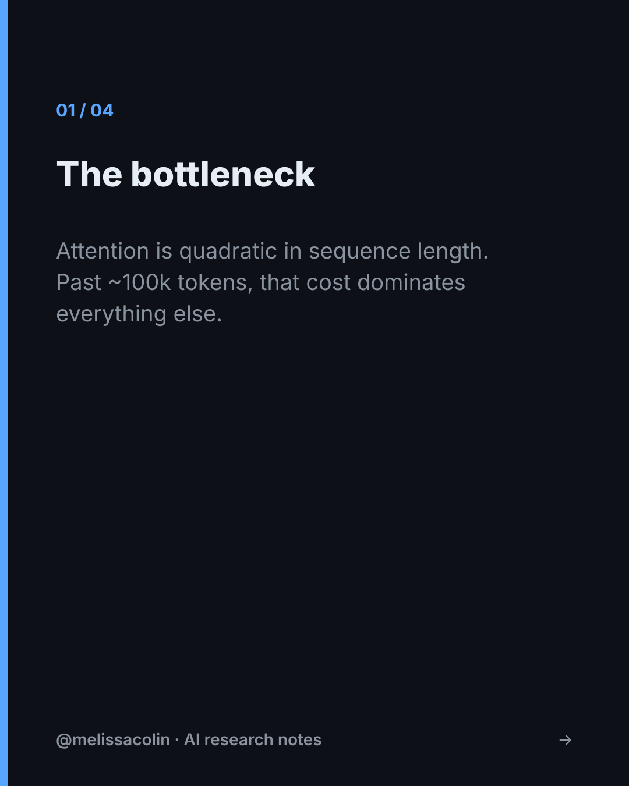
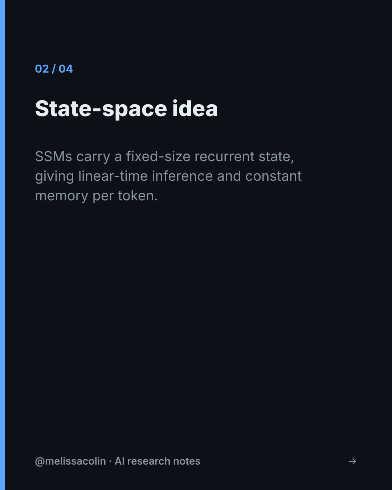

# 📰 Veille IA — autonomous daily AI intelligence

A fully automated pipeline that, **every morning in the cloud**, researches the
day's AI developments, writes a **source-checked technical brief**, narrates it as
a **French podcast**, drafts an **English LinkedIn post + carousel**, and drops the
whole bundle into Google Drive — where a **GNOME top-bar indicator** lights up to
tell me a new episode is ready.

It runs while my computer is off. If I'm away for days, I come back to one episode
per day, and the top-bar badge shows how many I haven't heard yet.

> Built as a daily research-intelligence habit — and as an exercise in shipping a
> robust, dependency-light, multi-agent system end to end.

---

## What it produces each day

| Artifact | Language | Notes |
|---|---|---|
| `technical_doc.md` | FR | Deep technical brief, every claim cross-checked against its primary source |
| `verification_report.md` | FR | Per-claim verdict table (✅ / ❔ / ❌) with supporting quotes |
| `sources.md` | FR | Deduped primary sources, grouped by domain, with verification status |
| `podcast.mp3` | FR | ~30–60 min narrated episode (ElevenLabs TTS, ffmpeg-stitched) |
| `linkedin_post.md` + `carousel/*.png` | EN | Post + 1080×1350 slides for a research audience |

**Coverage**, in priority order: worldwide AI (techniques **and** policy) → model
**architecture** (esp. post-transformer) → **discourse** of influential figures →
**computer vision / 3D / motion** *(only when there's real news)* → one **wildcard**
deep-tech topic.

<p align="center">
  
  
  
</p>

---

## Architecture

```
GitHub Actions (cron, daily, UTC)
        │
        ▼
┌─────────────────────────────────────────────────────────────┐
│ A  Research      fan-out: 1 web-search agent per domain      │
│ B  Tech doc      per-item deep technical section + claims    │
│ C  Verify        re-fetch each source, quote-or-flag (Opus)  │  ← anti-hallucination core
│ D  Sources       compile + dedup + status                    │
│ E  Podcast (FR)  script → ElevenLabs (chunked) → ffmpeg mp3  │
│ F  LinkedIn (EN) post + SVG carousel → PNG (rsvg-convert)    │
│ G  Publish       manifest + feed.json → rclone → Drive       │
└─────────────────────────────────────────────────────────────┘
        │
        ▼
   Google Drive  ──sync──►  ~/gdrive/veille/
        │
        ▼
   GNOME top-bar extension (stage H) — 📰(n) badge → click → play / open
```

See [`docs/ARCHITECTURE.md`](docs/ARCHITECTURE.md) for the design rationale.

### Design choices worth noting
- **Anti-hallucination by construction.** The writer must attach a source URL to
  every atomic claim. A separate verifier re-fetches each source and either quotes
  the supporting span or flags the claim ⚠. Numeric/SOTA claims get independent
  re-checks before they're allowed to stand.
- **Multi-agent fan-out.** Domains are researched in parallel by independent agents;
  conditional domains (vision/3D, wildcard) return *"nothing notable"* rather than
  padding the brief.
- **Zero runtime npm dependencies.** The whole pipeline runs on the Node 20 standard
  library + three ubiquitous CLIs (`rsvg-convert`, `ffmpeg`, `rclone`). No SDKs, no
  browser, no `node_modules` to rot. The Anthropic API is called over plain `fetch`;
  carousels are SVG rasterized with `rsvg-convert`.
- **Pluggable brain.** One interface, two engines: the local `claude -p` CLI (Claude
  Max, no token billing) or the Anthropic REST API (cloud). Stages don't know which.
- **Drive as transport.** The job is stateless and idempotent; Google Drive carries the
  bundle, so a laptop that was off just syncs the backlog on boot.

---

## Quick start

```bash
cp .env.example .env          # add ANTHROPIC_API_KEY (+ ELEVENLABS_API_KEY for audio)
# set podcast.tts.voiceId in pipeline/config.json
node pipeline/src/orchestrate.mjs --dry-run   # full run, skips TTS + Drive delivery
node pipeline/src/f_linkedin.mjs --demo        # render a sample carousel, no API
bash desktop/install-extension.sh              # install the GNOME top-bar indicator
```

Full setup (Drive service account, GitHub secrets, cron) is in
[`docs/SETUP.md`](docs/SETUP.md).

## Two engines (pick in `pipeline/config.json` → `engine`)

| | `claude-code` (default) | `api` |
|---|---|---|
| Brain | local `claude -p` CLI on a **Claude Max** plan | Anthropic REST (pay-per-token) |
| Text cost | **$0** (covered by Max quota) | ~$40–75/mo |
| Scheduler | **systemd user timer** (local) | GitHub Actions cron (cloud) |
| Runs while PC is off? | No — but `Persistent=true` fires a missed run on next boot | Yes |

The local engine trades always-on for zero text cost; the missed-run-on-boot
behaviour means you still get the day's brief when you power on.

## Cost (transparent)

With the default **`claude-code`** engine, the only paid piece is the voice:

| | Lean (~30 min podcast) | Full 1 h |
|---|---|---|
| ElevenLabs | Pro ~$99/mo | Scale ~$330/mo |
| Text (Claude Max) · carousel · scheduler | $0 | $0 |
| **Total** | **~$99/mo** | **~$330/mo** |

Duration is one number in `pipeline/config.json` (`podcast.targetMinutes`).

## Tech stack
Node 20 (ESM, no deps) · Anthropic Messages API + web search · ElevenLabs TTS ·
`ffmpeg` · `rsvg-convert` · `rclone` + Google Drive · GitHub Actions · GNOME Shell
extension (GJS).

## License
MIT — see [`LICENSE`](LICENSE).
